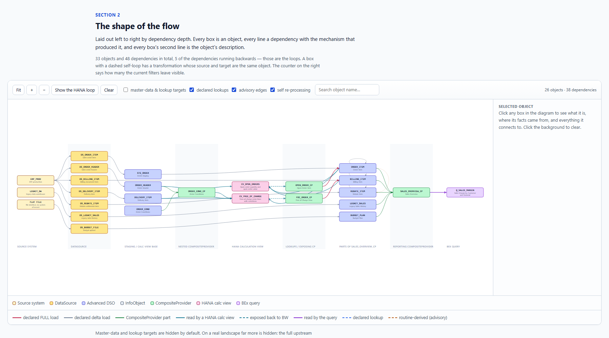

# Interactive lineage report — example output

An example of what this server produces for one BEx query: the objects behind it, how they
connect, what the transformations do, and what the HANA calculation views compute.

**Open [`lineage-report.html`](lineage-report.html) in a browser.** It is one self-contained file —
CSS, JavaScript and data inlined — so it works from the local filesystem with no network access
and nothing to install.

GitHub does not render HTML inline in a repository view, so reading it here means downloading it.
`.github/workflows/pages.yml` publishes it as a browsable page instead, and it deploys on any push
that touches this directory — but only once Pages is switched on under **Settings → Pages → Build
and deployment → Source: GitHub Actions**. Until then the workflow fails at its deploy step, which
is harmless but visible. Note that Pages on a private repository needs GitHub Pro, Team or
Enterprise Cloud; on the Free plan it becomes available when the repository is made public.

The workflow publishes **only this example** — the report and its preview image, not the
repository. That is deliberate. A Pages site is a public surface, and the example's landscape is
the only thing here that is synthetic by construction; the README, CHANGELOG and `docs/` discuss
findings measured against a real system.



## Every name in it is invented

This repository contains **no customer metadata**, and the example is not an exception. The
landscape in `sample_landscape.py` is synthetic, and CI fails the build if a real BW object name
or an internal host name appears anywhere in the tree or in git history.

What is realistic is the *shape*: a report on a CompositeProvider that unions five stores, two of
which are full-loaded out of HANA calculation views that read other BW objects and hand the result
back. That shape is the reason this output is worth reading, and a tidy three-box example would
not demonstrate it.

## What it demonstrates

| | |
|---|---|
| **Object descriptions** | Every box carries BW's description on a second line, and anything not stored verbatim in BW is marked as such |
| **Provenance per fact** | Declared vs advisory on every edge, with the mechanism named on hover |
| **Routine parsing** | Table dependencies, anti-patterns and complexity per routine, reported as a lower bound |
| **Calculation-view logic** | What each view *produces*, its node tree, filters and calculated-column formulas |
| **The loops** | BW → HANA → BW paths drawn as back-edges, including a calculation view reading a CompositeProvider |

Things to try in the diagram: click a box to see what it is and everything it connects to; switch
on master-data lookups and watch the layout recompute over what is left; hover an edge to see
whether the relationship is declared in metadata or was parsed out of ABAP. Search, drag to pan,
scroll to zoom, <kbd>Esc</kbd> to reset.

## Regenerating

```bash
python examples/interactive-lineage/build.py
```

No dependencies beyond the standard library. Nothing connects to anything.

| File | What it is |
|---|---|
| `sample_landscape.py` | The synthetic facts: objects, descriptions, edges, findings, routines, view logic |
| `build.py` | Layered layout and HTML rendering |
| `assets.py` | CSS and JavaScript — presentation only, knows nothing about any landscape |
| `lineage-report.html` | The rendered result, committed so it can be read without running anything |
| `preview.png` | The screenshot above |

## How this differs from a real run

The renderer here is driven by a literal Python dict. Against a live system the same shape comes
from `bw_get_lineage`, `bw_describe_object`, `bw_get_transformation`, `bw_analyze_routine`,
`bw_get_calc_view_logic` and `bw_get_calc_view_lineage`.

Two honest differences:

- **A real graph is much larger.** The full upstream graph for one production query routinely runs
  to a couple of hundred objects, most of them the master-data supply chains behind customer,
  material and plant. A real report draws a curated spine and says what it left out.
- **Real output belongs outside this repository.** It contains ABAP routine source, query
  definitions, chain schedules and object names — customer intellectual property. `output/` is
  git-ignored for that reason, and the leak check scans history as well as the working tree,
  because a squashed commit does not remove history.
